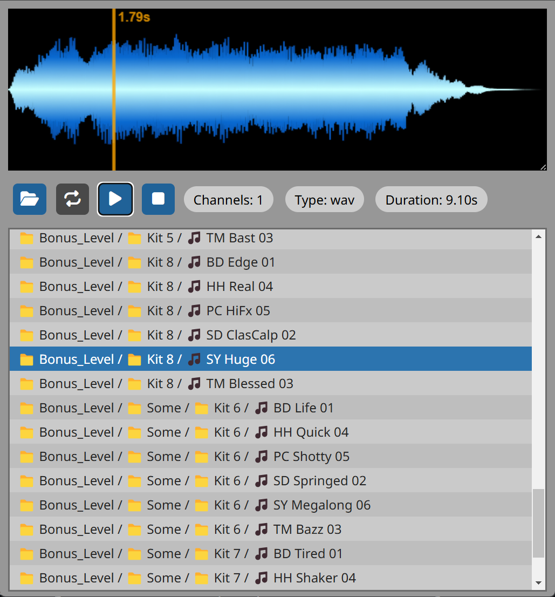

# Audio File Browser

A web based audio file browser & explorer for easy previewing and discovery of sound files & samples.

Written in vanilla JavaScript using AlpineJS, no build/bundle step

Features:

- Recursively scans directories for supported files (wav, mp3, ogg & flac)
- Optional looped playback
- Volume controls
- Visualization of the waveform
- Scrubbing and playback from any point

